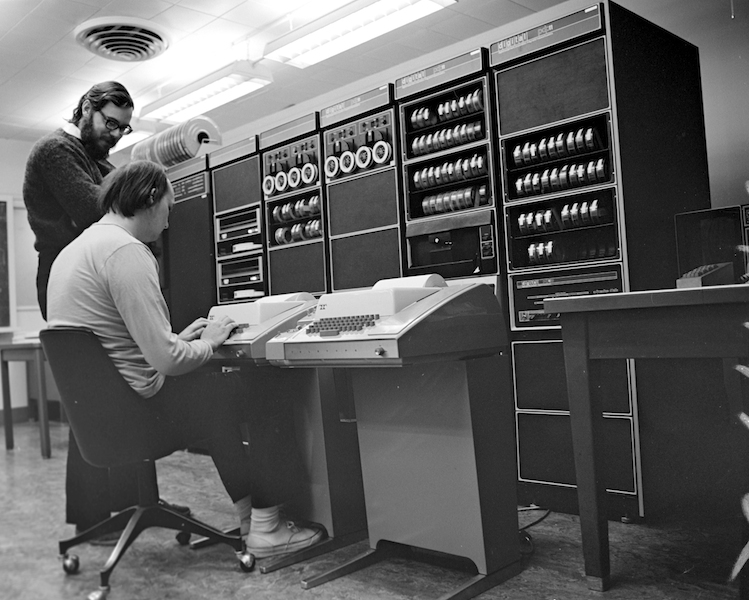
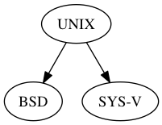
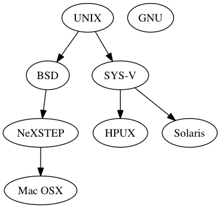
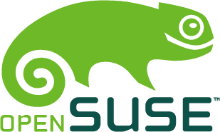
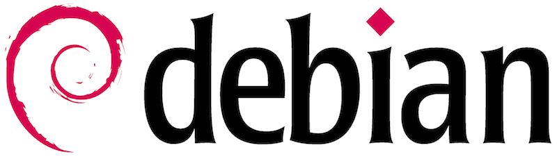
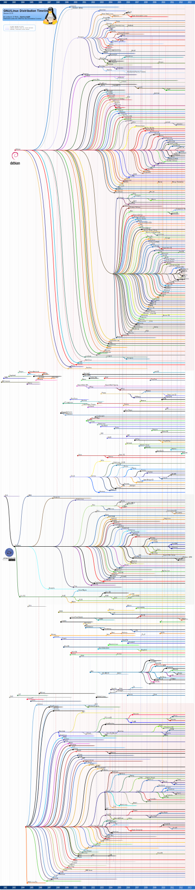

author: Derek Carter aka "goozbach"  
company: Goozbach Infrastructure Solutions  
title: Linux Distribution Shootout
subtitle: A Primer For All
footer: Derek Carter  -- derek@goozbach.com  
subfooter: http://presentation.goozbach.com/

!SLIDE fullscreen center
### History

in the begining…

!SLIDE fullscreen center
### Darkness
{{ background #444 }}
{{ foreground #aaa }}

!SLIDE fullscreen center
### 1960 something computing
{{ background #444 }}
{{ foreground #aaa }}

!SLIDE fullscreen center
### No (not a lot of) General Purpose Computing
{{ background #444 }}
{{ foreground #aaa }}

# These Guys
{{ background #444 }}
{{ foreground #aaa }}
* mit
* general electric
* at&amp;t bell labs

# Created MULTICS
"Multiplexed Information and Computing Service"
{{ background #999 }}
{{ foreground #fff }}

# MULTICS
Had some great ideas.
{{ background #999 }}
{{ foreground #fff }}

# MULTICS
Was a *BIG* project.
{{ background #999 }}
{{ foreground #fff }}

# MULTICS
Had it's own problems
{{ background #999 }}
{{ foreground #fff }}

# MULTICS
Was *TOO* big.
{{ background #999 }}
{{ foreground #fff }}

!SLIDE fullscreen image center 
## Two guys

{{ background #ccc }}

# Create UNIX

# But First

# They Create the C Language

# UNIX Philosphy
* Everything is a file
* Configuration in ASCII text
* Multi-User
* Multi-Tennant
* Single Rooted FS

!SLIDE fullscreen center
## time passess…
{{ background #cdf }}

# UNIX Becomes Popular

# UNIX "Liberally Licensed"
(aka given away)

!SLIDE fullscreen image center 
## UNIX Fragments

{{ background #fee }}

!SLIDE fullscreen center
## time passess…
{{ background #cdf }}

!SLIDE fullscreen image center 
## UNIX Fragments

!SLIDE fullscreen image center 
## This Guy

!SLIDE fullscreen center
## time passess…
{{ background #cdf }}

# Enter the Distro
Linux Kernel (the brain) + GNU Tools (the body) + Other Software (the accesories)

# Linux Distro Families
* Slackware (Formerly SLS)
  * SUSE
* Debian
  * Ubuntu
* RedHat
  * Fedora
* Special purpose

!SLIDE fullscreen image center 
## Slackware

# Slackware
* For advanced users
* Simplistic installer (No GUI)
* One of, if not the oldest distro still maintained
  * Still uses BSD style init system
* Parent distro of SUSE (kinda)
* Simple package management
  * Uses Tarballs (think zip files)
  * No dependancy tracking

!SLIDE fullscreen image center 
## SUSE

# SUSE Family
* German engineering meets Linux distribution
* YAST tool
* RPM packages
* More cutting edge than other "enterprise" distros
* Storied past

!SLIDE fullscreen image center 
## Debian

# Debian Family :: Debian
* Improving not only the distro idea but also the "community" idea of a distro
* Slow and steady development
* Open development Model
* *LARGE* software repositories
* DPKG package format
* APT tool manages dependancies
* Rolling Releases

!SLIDE fullscreen image center 
## Ubuntu

# Debian Family :: Ubuntu
* Debian meets commercial support
* "Downstream" of Debian
* Offers support
* Long Term Support

!SLIDE fullscreen image center 
## RedHat

# RedHat Family :: RedHat Enterprise Linux (formerly RedHat Linux)
* One of the first "Commercially Supported" Distros
* RPM package management
* YUM dependancy management
* Subscription Based
* Basis of many "Enterprise" distros

!SLIDE fullscreen image center 
## Fedora

# RedHat Family :: Fedora (formerly Fedora Core Linux)
* "upstream" to RHEL
* Community supported by RedHat (the company)

!SLIDE fullscreen image center 
## CentOS

# RedHat Family :: CENTOS (formerly kinda CaOS Linux and others)
* "Rebuild" of Enterprise Linux sources
  * YAY GPL!
* Now supported by RedHat as technology incubator platform

!SLIDE fullscreen image center 
## Others

# Special Purpose Distros
* TIVO replacement
* Smartphone
* Large Haldron Colider
* Raspberry pi
* Gaming platform
* Car entertainment system
* You name it

# Which should I use?
* It's really up to you.
* Try them all and figure which one you love.
* It's free!

!SLIDE
<form class="ym-form">
  

    <h3>Contact Derek</h3>
    

    
    <a class="url fn n" href="http://goozbach.com">  Derek
    Cullen
    Carter
    </a>
    
Goozbach Infrastructure Solutions

    

    
165 E Dougherty St. Suite 205

    Athens
  , 
    GA
  , 
    30601
  
    USA
  
   
  
   <a class="email ym-button ym-email" href="mailto:derek@goozbach.com">derek@goozbach.com</a>
   
+1 (706)521-0151

   <a class="url ym-button" href="http://blog.friocorte.com/resume/">Resum&#x00e9;</a>
    
   <a class="url ym-button" href="aim:goim?screenname=friocorte">AIM</a>
   <a class="url ym-button" href="xmpp:goozbach@gmail.com">Jabber</a>
   <a class="url ym-button" href="https://github.com/goozbach">GitHub Profile</a>
   <a class="url ym-button" href="http://presentation.goozbach.com/">Presentations</a>
    
   <a class="url ym-button" href="https://twitter.com/goozbach">@goozbach -- twitter</a>
   <a class="url ym-button" href="http://identi.ca/goozbach">@goozbach -- identi.ca</a>
    
   <a class="url ym-button" href="irc:irc.freenode.net#utah">IRC irc.freenode.net/#utah</a>
   <a class="url ym-button" href="irc:irc.freenode.net#ale">IRC irc.freenode.net/#ale</a>
   <a class="url ym-button" href="irc:irc.freenode.net#utos">IRC irc.freenode.net/#utos</a>
    
   <a class="url ym-button" href="http://pgp.mit.edu:11371/pks/lookup?op=get&search=0xF6C5E07D14E825A9">GPG Key Fingerprint -- E2BA B9B8 B802 B33F 08EE  C4FF F6C5 E07D 14E8 25A9</a>
   
This <a href="http://microformats.org/wiki/hcard">hCard</a> created with the <a href="http://microformats.org/code/hcard/creator">hCard creator</a>.

  

</form>
